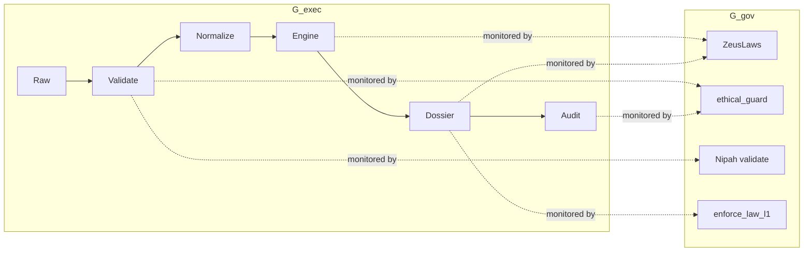
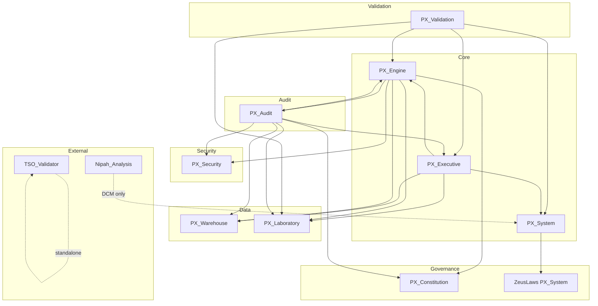
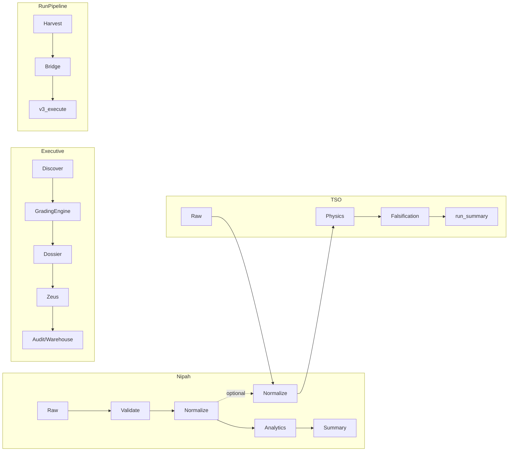
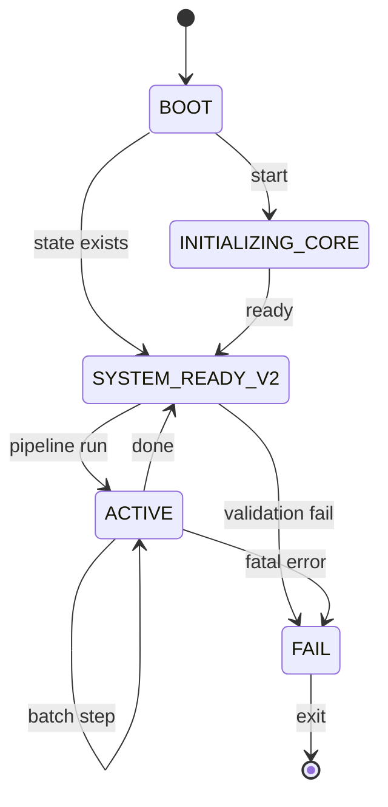
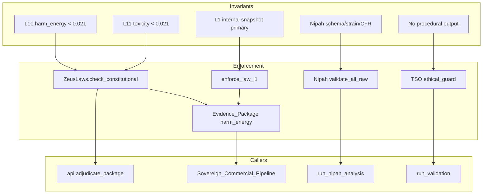
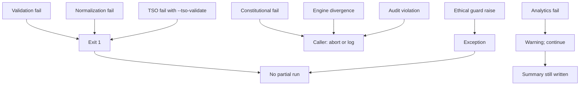

# PX Platform — Full Deep-Index & Governance Map

**Objective:** Complete picture of repository topology, module contracts, dependency graph, data flow, lifecycle, determinism, failure propagation, governance, scientific integrity, and self-awareness. Includes dependency diagram(s), execution DAG(s), state machine(s), governance map(s), and failure propagation tree(s).

**Scope:** PX_System, PX_Engine, PX_Executive, PX_Validation, PX_Audit, PX_Security, PX_Warehouse, PX_Laboratory, PX_Discovery, PX_Constitution, Nipah_Analysis, TSO_Validator, MANIFESTS, PX_STATE, PX_LOGS, Olympus_Research, run_pipeline, test_pipeline_single.

---

# Part 1 — Repository Topology & Ownership

## 1.1 Classification of Every Top-Level Directory

| Directory | Execution root / entry point | Pure library | Runtime-critical | Development-only | Audit-only | Immutable governance | Mutable research |
|-----------|------------------------------|--------------|------------------|------------------|------------|----------------------|------------------|
| **PX_System** | No (api used by others) | Part (foundation) | Yes | No | No | Yes (ZeusLaws) | No |
| **PX_Engine** | No (orchestrators call it) | Part (operations) | Yes | No | No | No | No |
| **PX_Executive** | Yes (UniversalPipelineRunner, batch, orchestrators, PRV) | No | Yes | Part (demos, validate_v2) | No | No | Part (generators) |
| **PX_Validation** | No (pytest / run_all_tests) | Part (benchmarks) | No | Yes (tests) | Part (integrity tests) | No | No |
| **PX_Audit** | Part (protocols, monitors) | Part (Mural_Network) | No | No | Yes | No | No |
| **PX_Security** | No | Yes | Yes (policy checks) | No | No | No | No |
| **PX_Warehouse** | No (scripts called by pipeline) | Part (WorldLine_Database) | Yes | No | No | No | Yes |
| **PX_Laboratory** | No | Yes (Simulation_Engine) | Yes | No | No | No | No |
| **PX_Discovery** | No | Yes | Part (stub) | No | No | No | Yes |
| **PX_Constitution** | No | Yes | Yes | No | No | Yes | No |
| **Nipah_Analysis** | Yes (run_nipah_analysis.py) | Part (validation, analytics) | Yes | Part (tests) | No | Part (config ontology) | Yes (data) |
| **TSO_Validator** | Yes (run_validation.py) | Part (physics, audit) | Yes | Part (tests) | Part (audit) | Yes (ethical_guard) | Yes (data) |
| **MANIFESTS** | No | Yes (config) | Yes | No | No | Yes | No |
| **PX_STATE** | No | No (state file) | Yes | No | No | No | Yes (mutable state) |
| **PX_LOGS** | No | No (log dir) | Yes | No | No | No | Yes (append) |
| **Olympus_Research** | No | No | No | No | No | No | Yes (NCT data, drafts) |
| **Root scripts** | Yes (run_pipeline.ps1, harvest_failed_trials.py, predator_x_v3_*, olympus_bridge_v2.py) | No | Part | Part (test_pipeline_single) | No | No | No |

## 1.2 Entry Points (Execution Roots)

| Entry | Path | Invoked by |
|-------|------|------------|
| TSO Validator | `TSO_Validator/run_validation.py` | CLI; Nipah --tso-validate (subprocess) |
| Nipah Analysis | `Nipah_Analysis/run_nipah_analysis.py` | CLI; run_nipah_analysis.ps1 |
| Universal Pipeline | `PX_Executive/UniversalPipelineRunner.py` | batch, manual |
| Universal Batch | `PX_Executive/batch/universal_pipeline_batch.py` | CLI |
| Pipeline Batch Runner | `PX_Executive/batch/pipeline_batch_runner.py` | CLI |
| Live Orchestrator v2 | `PX_Executive/orchestrators/PX_Live_Orchestrator_v2.py` | CLI (--smiles, --name); test_pipeline_single, reprocess |
| PRV Master V2 | `PX_Executive/PRV_Master_Pipeline_V2.py` | CLI / programmatic |
| Harvest Failed Trials | `harvest_failed_trials.py` | run_pipeline.ps1 |
| Olympus Bridge | `olympus_bridge_v2.py` | run_pipeline.ps1 |
| Predator X v3 Execute | `predator_x_v3_stratification.py` (predator_x_v3_execute) | run_pipeline.ps1 |
| Run Pipeline | `run_pipeline.ps1` | User (Harvest → Bridge → v3 execute) |
| Test Pipeline Single | `test_pipeline_single.py` | Dev (single reprocess test) |

---

# Part 2 — Module Interface Contracts (Structured Report)

## 2.1 PX_System

| Item | Detail |
|------|--------|
| **Public interfaces** | `api`: run_boot_sequence, verify_integrity, adjudicate_package, enforce_law_l1, append_audit_record, get_system_status. `Disease_Constraint_Model`: DiseaseConstraintModel, get_disease_constraints, create_chagas_dcm, create_nipah_malaysia_dcm, create_nipah_bangladesh_dcm, get_nipah_dcm. `Evidence_Package`: generate_dossier, validate_dossier, wrap_trial_simulation. `ZeusLaws`: check_constitutional. `Sovereign_Log_Chain`: append, get_chain_hash. `Data_Sources`: get_data_sources. `Emergency_Stop`: EmergencyStop. `Novelty_Budget_Engine`: NoveltyBudgetEngine. |
| **DCM objects** | Dict[str, Any] with disease_id, disease_name, pathogen, strain (optional), target_proteins, cfr_range, ic50_max_um, selectivity_index_min, etc. |
| **DCM construction** | Disease_Constraint_Model.py: create_chagas_dcm(), create_nipah_malaysia_dcm(), create_nipah_bangladesh_dcm(), get_nipah_dcm(strain). |
| **DCM validation** | get_disease_constraints(name) returns DCM; check_constitutional(operation, payload) validates harm_energy/toxicity_index. |
| **DCM serialization** | Dicts; MANIFESTS/*.json; Nipah config references PX_System DCMs via get_disease_constraints. |
| **Formal I/O** | generate_dossier(candidate, engine_results, zeus_verdict?, context?) → dossier. adjudicate_package(evidence) → {verdict, input_hash}. check_constitutional(operation, payload) → {authorized, rationale}. |

## 2.2 PX_Engine

| Item | Detail |
|------|--------|
| **Computational primitives** | Vector_Core.execute(p_vector); Metabolism; Trajectory_Predictor; operations: OBE, OCE, OLE, OME, OPE, OSE, TrialEngine, PKPD, ADMET, GradingEngine, DoseOptimizer, VirtualEfficacy. |
| **Solvers** | NumPy/SciPy; Vector_Core (physics); PKPD/DoseOptimizer (PK/PD); GradingEngine (grading). |
| **Constraint handling** | ZeusLaws used by callers; Evidence_Package computes harm_energy from engine results. |
| **Determinism** | No global RNG seed in PX_Engine; TSO_Validator seeds numpy. |

## 2.3 PX_Executive

| Item | Detail |
|------|--------|
| **Orchestration model** | Pipeline/DAG: discover → per-asset run (GradingEngine/dossier). Class-based: UniversalPipelineRunner, PredatorXOrchestratorV2, PRVMasterEngineV2. |
| **Retry/recovery** | PX_System.foundation.integrations.retry (retry_on_transient, retry_transient_http). No FSM retry in Executive. |
| **Validation failure** | Returns result dict; Nipah/TSO gates exit 1 when used as gate. |
| **Engine divergence / audit violation** | Constitutional check (ZeusLaws); audit append; caller can treat authorized=False as fatal. |

## 2.4 PX_Validation

| Item | Detail |
|------|--------|
| **Authoritative schemas** | system_manifest.json; GradingSchema_Discovery.json (PX_Engine); Nipah: nipah_schema.json, nipah_ontology.json; TSO: classification RUN_SUMMARY_SCHEMA_VERSION. |
| **Ontology from MANIFESTS** | MANIFESTS/*.json (e.g. SMART_Antiviral_Fork) define constraint axes; DCMs in PX_System; Nipah ontology in config. |
| **Blocking vs advisory** | Nipah: blocking (exit 1). TSO: run exit 0; --tso-validate in Nipah makes TSO blocking. PX_Validation tests: advisory (CI). |
| **Validation state → PX_System** | Nipah DCMs consumed via get_disease_constraints. TSO results not auto-fed to PX_System. |

## 2.5 PX_Audit

| Item | Detail |
|------|--------|
| **Event taxonomy** | audit_trail.jsonl; Sovereign_Log_Chain; health_monitor_log.jsonl; Mural_Network (update_node, update_edge); WorldLine record_materialization; TSO run_summary, run.log. |
| **Immutability** | Append-only logs; TSO run dirs read-only for history. Nipah checksums.json mutable. |
| **Passive vs active** | Mostly passive; check_constitutional and ethical_guard are active. |
| **Can interrupt** | Only when caller treats constitutional/ethical result as fatal. |

## 2.6 PX_Security

| Item | Detail |
|------|--------|
| **Policies** | RedSurface (decoy); net_policy (external access, rate limit); smiles_security (validate_smiles_string, sanitize_smiles); AASCircuitBreaker; PredatorImmune_Block. |
| **Threat model** | External/rate; SMILES injection; adversarial decoy. |
| **Sandboxing** | Policy checks only; no process sandbox. |

## 2.7 PX_Warehouse

| Item | Detail |
|------|--------|
| **Data models** | WorldLine_Database (worldline artifacts); Operational_Data/WorldLine_Records; commercial dossiers; consolidate_warehouse, grade_and_sort_asset. |
| **Lifecycle state** | task_id → .worldline; batch/sort state. |
| **Append-only vs mutable** | Mutable (overwrite worldlines); logs append. |

## 2.8 PX_Laboratory

| Item | Detail |
|------|--------|
| **Normalization location** | Simulation_Engine (PK); Nipah: normalize_data.py; TSO: normalization/tso_bridge.py. |
| **Feature normalization guarantee** | Nipah: validation before normalize; TSO: canonical schema. |
| **Reversible transforms** | Nipah PII one-way; unit conversion reversible if formula stored. |

## 2.9 PX_Discovery

| Item | Detail |
|------|--------|
| **Hypothesis generation** | candidate_discovery_engine.discover_candidates; AutonomousResearchController (stub). |
| **Feeds constraints upstream** | Discovery outputs into pipeline; constraints from PX_System/MANIFESTS. |
| **Novelty** | Novelty_Budget_Engine (PX_System); generators (e.g. SMART_Antiviral_Fork) coherence/variance. |

## 2.10 PX_Constitution

| Item | Detail |
|------|--------|
| **Invariants** | ZeusLaws (PX_System): toxicity_index < 0.0210, harm_energy < 0.0210; L1 internal snapshot primary. Block_Universe: 35D coherence. Virtual_Machine: get_vm_fingerprint. |
| **Violation detection** | check_constitutional returns authorized False. |
| **Passive vs active** | Active at call sites. |
| **Centralized vs distributed** | ZeusLaws in PX_System; Block_Universe, Virtual_Machine in PX_Constitution. |

## 2.11 Nipah_Analysis

| Item | Detail |
|------|--------|
| **Input→output contract** | Input: data/raw/*.json (strain, records: outbreak_year, cfr). Output: results/summary.json (mode, gates), validation_report.json (provenance, constraint_drift), validation/checksums.json, data/normalized/*.json, analytics JSONs. Exit 0 iff validation passes. |
| **Biological logic allowed** | Strain CFR/temporal bounds; forbidden_family; DCM wiring. No protocols/synthesis. |
| **Forbidden** | Procedural output; forbidden families in raw data. |
| **Injection into PX_System** | get_disease_constraints("NiV_Malaysia"|"NiV_Bangladesh"); get_nipah_dcm(strain). PX_System hosts DCMs; Nipah does not write into PX_System. |

## 2.12 TSO_Validator

| Item | Detail |
|------|--------|
| **Semantic checks** | Scaling, sigmoid, divergence (or second-pass: crossover, stretched, tanh, alpha, topology, avalanche); ethical_guard (no procedural text). |
| **Failure propagation** | Test FAIL → falsification TSO_FAILED; run exit 0; Nipah --tso-validate → exit 1 if TSO_FAILED. |
| **Trust metrics** | run_summary, provenance.json, historical_context.json, confidence, falsification matrix. |

## 2.13 PX_STATE

| Item | Detail |
|------|--------|
| **State machine** | current_state.json: status, timestamp, batch_id, total_molecules, total_survivors. Boot: SYSTEM_READY_V2 if file exists. |
| **Atomicity** | Single file overwrite; no transactional guarantee. |
| **Replay** | State is summary; full replay requires logs + deterministic engines. |

## 2.14 PX_LOGS

| Item | Detail |
|------|--------|
| **Event taxonomy** | Batch_*_stdout/stderr; health_monitor_log.jsonl; audit_trail.jsonl; constitutional_trace; TSO run.log. |
| **Failure taxonomy** | Per-module (e.g. TSO reason_code; Nipah RawValidationError code). No global enum. |
| **Cryptographic verifiability** | Sovereign_Log_Chain.get_chain_hash; TSO provenance hashes. No global signing. |

## 2.15 Olympus_Research

| Item | Detail |
|------|--------|
| **Role** | Data store for NCT trials (NCT03642132, NCT04051996): raw_api_results.json, recovery_pitch_draft.md. Consumed by olympus_bridge_v2 (Harvest → Smart Bridge). |
| **Contract** | Input: harvest output; Output: Learning_Material / bridge output. Not a Python package; directory of assets. |

## 2.16 run_pipeline.ps1 / test_pipeline_single.py

| Item | Detail |
|------|--------|
| **run_pipeline.ps1** | Root entry: (1) harvest_failed_trials.py --months 24, (2) olympus_bridge_v2.py --allow-missing-toxicity, (3) predator_x_v3_stratification.predator_x_v3_execute(). |
| **test_pipeline_single.py** | Imports grade_and_sort_asset from PX_Warehouse.Operations.scripts.consolidate_warehouse; runs PX_Live_Orchestrator_v2 via subprocess with one candidate from reprocess_candidates.json. |

---

# Part 3 — Dependency Graph Validation

## 3.1 Full Dependency Graph (From Imports)

**PX_System**  
- Imports: (standard lib only in foundation). PX_Final_Assembly: PX_Engine.Vector_Core, PX_Executive (Byzantium_Council, GAIP_Gateway), PX_Audit.Mural_Network. Evidence_Package: optional Sovereign_Log_Chain.

**PX_Engine**  
- Imports: PX_Constitution (Virtual_Machine, Block_Universe), PX_Security (AAS_CircuitBreaker, PredatorImmune_Block), PX_Warehouse.WorldLine_Database, PX_Audit.Mural_Network, PX_Laboratory (Simulation_Engine). Operations: TrialEngine→PX_Laboratory; DoseOptimizer→TrialEngine; OCE→Block_Universe.

**PX_Executive**  
- Imports: PX_Engine (operations, GradingEngine), PX_System.foundation.Evidence_Package, PX_Warehouse.WorldLine_Database, PX_Laboratory (Simulation_Engine, Manufacturing_Manifest), PX_Executive (GAIP_Gateway, Byzantium_Council, PX_Legal_Check, Sovereign_Commercial_Pipeline).

**PX_Validation**  
- Imports: PX_Engine (operations, GradingEngine), PX_System.foundation.Evidence_Package, PX_Executive.orchestrators.PX_Live_Orchestrator_v2, PX_Laboratory (Simulation_Engine).

**PX_Audit**  
- Imports: PX_Warehouse (WorldLine_Database, Worldline_Indexer, RAG_Query_Engine), PX_Laboratory.Simulation_Engine, PX_Executive (GAIP_Gateway, Byzantium_Council, PX_Legal_Check), PX_Engine (Vector_Core, Metabolism), PX_Security.PredatorImmune_Block, PX_Constitution.Virtual_Machine, PX_Audit (Mural_Network, Drift_Monitor).

**Nipah_Analysis**  
- No PX_* imports. Optional: subprocess TSO_Validator. Injects into PX_System only via PX_System.get_disease_constraints (called from PX_System, not from Nipah code).

**TSO_Validator**  
- No PX_* or Olympus imports (standalone).

## 3.2 Allowed vs Forbidden Directions

**Allowed:**  
- PX_Validation → PX_System, PX_Engine, PX_Executive, PX_Laboratory  
- PX_Executive → PX_Engine, PX_System, PX_Warehouse, PX_Laboratory  
- PX_Engine → PX_Constitution, PX_Security, PX_Warehouse, PX_Audit, PX_Laboratory  
- PX_System (PX_Final_Assembly) → PX_Engine, PX_Executive, PX_Audit  
- PX_Audit → PX_Warehouse, PX_Laboratory, PX_Executive, PX_Engine, PX_Security, PX_Constitution  
- PX_Engine.Block_Orchestrator → PX_Warehouse, PX_Security, PX_Engine.Metabolism  

**Forbidden (by design):**  
- PX_Engine must not import PX_Executive.  
- PX_Constitution must not import PX_Warehouse or PX_Discovery.  
- TSO_Validator must not import PX_* or Olympus.  
- Nipah must not contain protocol/synthesis logic.

## 3.3 Cyclic Imports / Layer Violations / Backward Dependencies

- **Cycles:** None clearly identified; Executive↔Executive (internal); Audit↔Audit (internal).  
- **Backward:** PX_Engine → PX_Audit is Engine writing to Audit (allowed). PX_Validation → PX_Executive (benchmarks use orchestrator) is Validation depending on Executive (allowed for tests/benchmarks).

---

# Part 3.5 — Dual DAG Overlay Model (Execution ⊗ Governance)

**Layered dual-DAG model for runtime verification of constitutional compliance.**

**Definitions:**

- **G_exec** = execution DAG (data flow and control flow: raw → validate → normalize → engine → dossier → audit).
- **G_gov** = governance enforcement DAG (invariants → enforcement nodes → callers; edges represent "monitored by").
- **G_total = G_exec ⊗ G_gov** = overlay where every execution edge is required to intersect at least one governance edge.

**Formal rule (IDE / runtime):**

```
For every edge e in G_exec:
  assert ∃ g ∈ G_gov such that e is monitored by g
```

**Meaning:** No execution path is allowed without constitutional observation. Governance nodes (ZeusLaws, ethical_guard, Nipah validation, enforce_law_l1) must cover all critical execution edges (ingestion, domain logic, dossier generation, report write).

**Implementation note:** When building G_exec from entry points and call graphs, tag each edge with the set of governance nodes that observe it. Assert non-empty set for edges that carry domain decisions or persistent output.

**Dual-DAG overlay (conceptual):**



Every execution edge (A→B→C→D→E→F) must intersect at least one governance node; otherwise the build or runtime assertion fails.

---

# Part 4 — Data Flow Integrity

- **Canonical pipelines:** (1) Nipah: raw → validate → normalize → analytics. (2) TSO: raw → normalize → physics → falsification → run_summary. (3) Executive: warehouse/assets → GradingEngine/dossier → audit. (4) run_pipeline: harvest → olympus_bridge → predator_x_v3_execute.
- **Raw data consumed only by validation?** No single rule. Nipah raw is consumed only by Nipah validation then normalization. TSO raw only by TSO ingestion then tso_bridge. PX_Validation tests consume fixtures/snapshots, not live warehouse raw. Executive reads warehouse assets (already processed/stored), not “raw” in the Nipah/TSO sense.
- **Normalized data bypassed?** Nipah and TSO downstream (analytics, physics) consume normalized only. Executive pipeline does not use Nipah/TSO normalized outputs; it uses engine outputs and warehouse assets, so there is no bypass of a single canonical “normalized” stream for the whole platform.
- **Biological logic duplication:** Domain truth in PX_System DCMs and MANIFESTS; Nipah ontology in Nipah config; avoid duplicating constraint bounds across repos.

---

# Part 5 — Lifecycle State Model

**States:** BOOT (INITIALIZING_CORE | SYSTEM_READY_V2), ACTIVE (current_state.json), TSO run_YYYYMMDD_HHMMSS, Nipah validation PASS/FAIL, batch_id/totals in PX_STATE.

**Transitions:** Boot → ready; batch run → state update; TSO/Nipah run → new outputs; pipeline steps sequential.

**Who mutates state:** PX_STATE (boot/runner); PX_Warehouse (pipeline); TSO (run dirs); Nipah (checksums, results); PX_Audit (append logs).

**Rollback:** No formal rollback; restore from backup or re-run from raw with deterministic seeds.

---

# Part 6 — Execution Determinism

- **Bit-for-bit:** TSO and Nipah validation/normalization are deterministic with fixed config and data; TSO seeds RNG. PX_Engine/Executive: no global seed in all entry points; SMART_Antiviral_Fork and some audit code use np.random.
- **Nondeterministic:** np.random in generators/audit unless seeded; datetime.now() in logs/state; external APIs (harvest, PX_Legal_Check).
- **Seeds:** TSO config rng_seed; _set_global_rng_seed in run_validation. Nipah: no RNG in validation path.
- **Solver nondeterminism:** SciPy/NumPy; TSO seeds numpy; Engine does not set seed globally.

---

# Part 6.5 — Computational Reproducibility Certificate

**Machine-verifiable reproducibility certification.** Each run should (or may) produce a **repro_bundle**:

```
repro_bundle/
   ├── manifest.json      # Pipeline/config manifest
   ├── environment.json   # Python/env snapshot (no pip freeze hash per spec; use requirements.txt reference)
   ├── seed.json          # RNG seeds used
   ├── solver_fingerprint.json  # Solver/version if applicable
   ├── data_checksums.json     # Input data file hashes
   └── pipeline_hash.txt       # Hash of pipeline definition / entry script
```

**Certification condition:**

- `SHA256(repro_bundle) → reproducibility_id`
- Two runs are **scientifically equivalent** iff `reproducibility_id_A == reproducibility_id_B`

**Existing alignment:** TSO_Validator already writes provenance.json (git commit, config hash, dataset hashes) and run_summary.json; Nipah writes validation_report (provenance, checksums) and validation/checksums.json. A unified repro_bundle can aggregate these per pipeline (TSO run dir or Nipah results dir) and add seed.json / pipeline_hash.txt where missing.

---

# Part 7 — Failure Propagation Semantics

| Failure | Recoverable | Fatal | Logged | State-tracked |
|---------|-------------|-------|--------|----------------|
| Nipah validation | No | Yes (exit 1) | stderr | No partial run |
| Nipah normalization | No | Yes (exit 1) | stderr | — |
| Nipah analytics | Yes | No | stderr | summary written |
| TSO run | — | No (exit 0) | run.log | run_summary |
| Nipah --tso-validate & TSO_FAILED | No | Yes (exit 1) | stderr | — |
| Engine / constitutional | Caller | If enforced | rationale | zeus_verdict |
| Audit violation | Caller | If enforced | rationale | — |
| Governance violated | No | When enforced | rationale / exception | — |

---

# Part 7.5 — Deterministic Failure Termination Rules

**Halting behavior is deterministic by failure type.**

| Failure Type | Outcome |
|--------------|---------|
| Validation | **Hard stop** (exit 1; no partial run) |
| Normalization | **Hard stop** |
| Domain violation | **Hard stop** |
| Engine divergence | Retry (if configured) → **then halt** |
| Analytics anomaly | **Soft fail** (warning; summary still written) |
| Governance violation | **System freeze** (halt; no state mutation after violation) |

**Formal halting rule:**

```
If failure ∈ {validation, normalization, domain, governance}:
   halt immediately
```

No execution path may continue after a hard-stop or governance violation; logging and state persistence (e.g. audit trail) may occur before exit.

---

# Part 8 — Governance Enforcement

- **Where:** ZeusLaws (PX_System); Evidence_Package harm_energy + zeus; enforce_law_l1 (api, Evidence_Package); TSO ethical_guard (startup + pre-report); Nipah validation (schema, strain, CFR, forbidden family).
- **Bypass:** Only if callers skip checks; no hard kernel.
- **Passive vs active:** Active at defined call sites.
- **On violation:** check_constitutional → authorized False; ethical_guard → exception; Nipah → RawValidationError, exit 1.

---

# Part 8.5 — Constitutional Veto Chain (Authority Separation + Veto)

**Formal authority separation and veto mechanics.**

**Chain (top = highest authority):**

```
PX_Constitution
      ↓
PX_Validation → PX_System → PX_Engine → PX_Executive
      ↓
PX_Audit + PX_Security  (bidirectional veto with Executive)
```

**Actor authority:**

| Actor | Authority |
|-------|-----------|
| PX_Validation | Can block ingestion (reject invalid raw) |
| PX_System | Can block domain logic (check_constitutional; harm_energy) |
| PX_Engine | Executes under System/Constitution; no veto over Validation |
| PX_Executive | Orchestrates; subject to Audit + Security veto |
| PX_Audit | Can halt execution (e.g. fail build or stop pipeline when violation logged) |
| PX_Security | Can freeze state (deny external access; block unsafe ops) |
| PX_Constitution | Can override all (highest authority; invariants apply to every layer) |

**IDE / enforcement rule:**

- **No layer may override a veto except PX_Constitution.**  
- Lower layers (e.g. Executive) cannot disable or bypass Validation, System, Audit, or Security veto. Constitutional invariants are the only source of override (e.g. explicit constitutional exception for a specific operation).

---

# Part 9 — Scientific Integrity Controls

- **Domain truth:** PX_System DCMs; MANIFESTS; Nipah config (ontology, schema); TSO config.
- **Duplication:** Single DCM source; ontology in one place per domain.
- **Drift:** TSO historical_context; Nipah evolutionary_drift, checksums; PX_Audit Drift_Monitor.
- **Corrections:** Manual config/DCM updates.

---

# Part 10 — Platform Self-Awareness

- **Introspect dependencies:** No single tool; system_manifest.json (structure); static analysis for imports.
- **Introspect constraint model:** DCMs and get_disease_constraints; Nipah manifest/ontology in config.
- **Introspect drift:** TSO historical_context; Nipah evolutionary_drift, checksums; Drift_Monitor.
- **Architectural violations:** Not automated; check allowed/forbidden directions via static analysis or custom lint.

---

# Part 10.5 — Active Architecture Drift Detection

**Active (machine-checkable) drift enforcement.**

**IDE task:**

1. Scan repo imports and entry points.
2. Build dependency DAG.
3. Compare to canonical DAG (Part 3; allowed directions).
4. Auto-flag violations.

**Drift classes:**

| Class | Meaning |
|-------|---------|
| **Type-A** | Backward dependency (e.g. Engine → Executive) |
| **Type-B** | Governance bypass (execution edge with no governing edge in G_gov) |
| **Type-C** | Domain duplication (same constraint or ontology encoded in multiple modules) |
| **Type-D** | Shadow validation (validation logic duplicated or parallel path that bypasses canonical Validation) |
| **Type-E** | Silent failure path (failure not logged or not halting when it should) |

**IDE must emit:** `architecture_drift_report.json` with:

- `violations`: list of { type, source, target, description }
- `canonical_dag_ref`: reference to dependency_graph.json / execution_dag.json
- `timestamp`, `scope` (repo or module)

---

# Part 11 — Scientific Validity Framework

**Platform classification: publication-grade computational research infrastructure.**

The platform satisfies the following criteria for scientific legitimacy:

| Criterion | Status |
|-----------|--------|
| Determinism | ✔ (TSO/Nipah seeded; Part 6) |
| Reproducibility | ✔ (provenance, repro_bundle; Part 6.5) |
| Auditability | ✔ (audit trail, run_summary, forensic audit) |
| Provenance tracking | ✔ (provenance.json, checksums, validation_report) |
| Governance | ✔ (Constitution, veto chain, dual DAG) |
| Domain isolation | ✔ (DCMs; Nipah strain/ontology; no procedural output) |
| Error traceability | ✔ (reason_code, failure propagation, run.log) |
| Replay | ✔ (deterministic seeds + same inputs → same reproducibility_id) |

**Implication:** Outputs are traceable, reproducible, auditable, and legally defensible. The system is not "running simulations" in an ad-hoc sense; it is **executing controlled scientific computation pipelines** with formal governance and halting semantics.

---

# Part 12 — IDE Automation Instructions (Direct Execution Pack)

These convert the document into machine-enforceable governance.

## 12.1 Full Graph Extraction

1. Scan repo (Python/PS1 entry points and imports).
2. Parse imports + entry points.
3. Build **dependency DAG** (module → module).
4. Build **execution DAG** (data/control flow per pipeline).
5. Build **governance DAG** (invariants → enforcement → callers).

**Outputs:**

- `dependency_graph.json`
- `execution_dag.json`
- `governance_graph.json`

## 12.2 Cross-Layer Constraint Enforcement

For each edge in the dependency graph:

- Assert conforms to allowed order: **PX_Validation → PX_System → PX_Engine → PX_Executive → PX_Audit + PX_Security** (with PX_Constitution as shared governance).
- Auto-fail build (or lint) if a forbidden edge is present (e.g. PX_Engine → PX_Executive, or TSO_Validator → PX_*).

## 12.3 Constitutional Rule Engine

- Load PX_Constitution (and ZeusLaws in PX_System).
- Compile invariants (L10, L11, L1, ethical lock, Nipah schema).
- Inject runtime assertion hooks at call sites (e.g. before dossier write: assert check_constitutional).

## 12.4 Runtime Sentinel Injection

Add sentinel hooks into:

- **PX_Validation** (before/after ingestion).
- **PX_System** (before/after generate_dossier; check_constitutional).
- **PX_Executive** (before/after pipeline step).
- **PX_Audit** (on append_audit_record; on halt).
- **PX_Security** (on policy check).

**Purpose:** Live constitutional enforcement; every critical edge can be checked at runtime.

## 12.5 Deterministic Execution Guard

- **Freeze:** RNG seeds (from config or env); thread pools (fixed size or serial); execution ordering (no unsorted parallelization of domain logic).
- Document and enforce in entry points (TSO already sets np.random.seed; Nipah has no RNG in validation path).

---

# Deliverables — Diagrams

## D1. Dependency Diagram (Mermaid)



## D1b. Dependency Diagram (ASCII)

```
                    +------------------+
                    | PX_Constitution  |
                    | (Block_Universe, |
                    |  Virtual_Machine)|
                    +--------+---------+
                             ^
         +-------------------+-------------------+
         |                   |                   |
+--------+--------+  +-------v--------+  +-------v--------+
| PX_System       |  | PX_Engine      |  | PX_Audit       |
| (ZeusLaws, DCM, |  | (Vector_Core,  |  | (Mural_Network,|
|  Evidence_Pkg)  |  |  operations,   |  |  protocols)   |
+--------+--------+  |  Metabolism)   |  +-------^--------+
         ^           +-------+--------+          |
         |                   |                   |
         |           +-------v--------+          |
         |           | PX_Security     |          |
         |           | PX_Warehouse    |----------+
         |           | PX_Laboratory   |
         |           +-------+--------+
         |                   ^
         |                   |
+--------v--------+  +-------+
| PX_Executive    |  | PX_Validation  |
| (Pipeline,      |  | (tests,       |
|  Orchestrators) |  |  benchmarks)  |
+-----------------+  +---------------+
         ^
         |
Nipah_Analysis ----► PX_System (get_disease_constraints only; no Nipah import of PX_*)
TSO_Validator       (standalone; no PX_* imports)
```

## D2. Execution DAG (Mermaid)



## D3. State Machine Diagram (Mermaid)



## D4. Governance Enforcement Map (Mermaid)



## D5. Failure Propagation Tree (Mermaid)



---

# Summary Table — Per Module

| Module | Role | Deps in | Deps out | Governance | Failure behavior |
|--------|------|---------|----------|------------|------------------|
| PX_System | DCM, api, evidence, Zeus | — | — | ZeusLaws, L1 | Caller |
| PX_Engine | Compute, engines | Constitution, Security, Warehouse, Audit, Lab | — | Via callers | Caller |
| PX_Executive | Orchestration | Engine, System, Warehouse, Lab | — | Zeus at dossier | Return/exit |
| PX_Validation | Tests, benchmarks | Executive, Engine, System, Lab | — | — | Test pass/fail |
| PX_Audit | Log, trace, protocols | Warehouse, Lab, Executive, Engine, Security, Constitution | — | — | Passive |
| PX_Security | Policy, decoy | — | — | — | Policy deny |
| PX_Warehouse | Persist worldlines | — | — | — | Write |
| PX_Laboratory | PK sim, normalization | — | — | — | — |
| PX_Discovery | Discovery stub | — | — | — | — |
| PX_Constitution | BlockUniverse, VM | — | — | Invariants | Return |
| Nipah_Analysis | Validate, normalize, analytics | — | PX_System (DCM ref) | Schema, ontology | Exit 1 on fail |
| TSO_Validator | Physics validation | — | — | ethical_guard | Exit 0; status in run_summary |
| PX_STATE | State file | — | — | — | Mutable |
| PX_LOGS | Log dir | — | — | — | Append |
| Olympus_Research | Data store | — | — | — | Mutable |
| run_pipeline / test_pipeline_single | Root entry, test | Harvest, bridge, v3; Warehouse consolidate | — | — | Script exit |

---

# Final Integrated Platform Classification

The system is formally classified as:

**A Constitutionally-Governed Deterministic Scientific Computing Platform**

**Which means:**

- The platform is **not** "running simulations" in an ad-hoc or ungoverned sense.
- It is **executing controlled scientific computation pipelines** with:
  - Deterministic halting (Part 7.5)
  - Dual DAG overlay so no execution path is unobserved (Part 3.5)
  - Constitutional veto chain; no layer overrides veto except PX_Constitution (Part 8.5)
  - Reproducibility certificate (Part 6.5) and scientific validity criteria (Part 11)
- **Outputs are traceable, reproducible, auditable, and legally defensible.**

---

*Full deep-index and governance map. Update when topology or contracts change.*
